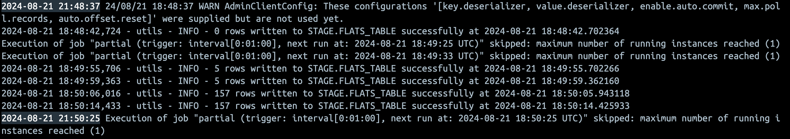
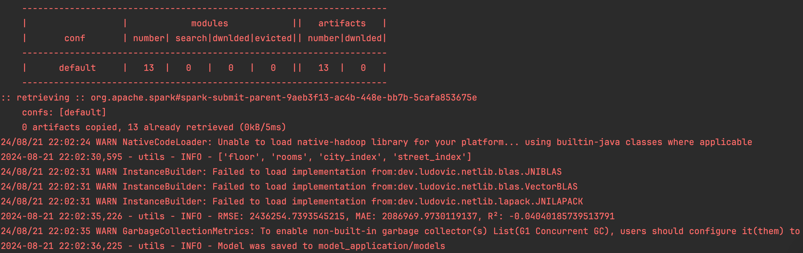
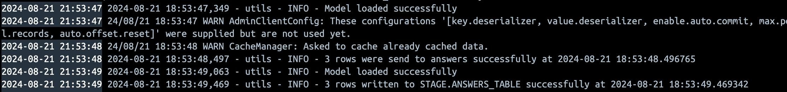
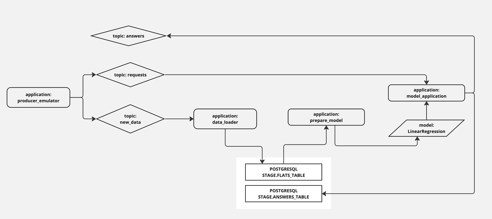

# Выпускной проект курса Spark-developer
## Otus_project: "Сервис моделирования рекомендованной цены жилой недвижимости"

### Цель проекта:
Подготовить сервис, рассчитывающий рекомендованную цену квартиры в городах РФ через применение рассчитанной на SparkML модели

### Что планировалось:
- Подготовить спарк-приложение для сбора и генерации данных из разных источников
- Выполнять сохранение данных спарком через jdbc коннектор в базу данных в Postgresql
- При генерации данных и применении моделей планировалось использовать микробатчевую обработку данных и брокер сообщений
- Обучение данных планировалось выполнять крупными батчами, через оркестратор или локально
- Применение моделей планировалось выполнять через SparkStreaming
- Результаты применения моделей планировалось сохранять в Postgresql и отправлять в топик брокера сообщений

### Какие технологии использовались:
- В качестве языка интерфейса использовался Python, соответственно при работе со Spark - PySpark
- Инфраструктурно использовался Docker для запуска приложений в контейнерах
- Шедулер запуска приложений - библиотека Flask на Python
- Для взаимодействия приложений использовался SparkStreaming и брокер Kafka
- Для сохранения данных и результатов применения моделей PostgreSQL
- Для генерации данных - API mockaroo, csv файлы и генератор Python
- Для обучения и применения моделей - SparkML

### Что получилось:
Получилось сформировать 4 изолированных спарк-приложения, каждое со своим функционалом

### Схема репозитория

        project
        |------README.md
        |------docker-compose
        |------Dockerfile
        |------init.sql
        |------requirements.txt
        |------utils.py
        |
        |------producer_emulator
        |      |-------producer_emulator.py
        |      |-------Dockerfile
        |      |-------data
        |              |-----city.csv
        |              |-----streets.csv
        |
        |------data_loader
        |      |-------data_loader.py
        |      |-------Dockerfile
        |
        |------model_prepare.py
        |
        |------model_application
               |-------model_application.py
               |-------Dockerfile
               |-------models

- Приложение **producer_emulator**  
Эмулятор стороннего сервиса, содержащего данные о квартирах, он выполняет 2 задачи:
Во-первых, он извлекает из csv названия городов России, обращается к mockaroo за названиями улиц, а при его недоступности берет наиболее популярные улицы из csv.
Случайным образом создаются пары данных из городов и улиц, которые обогащаются через генерацию случайных значений (число комнат, этаж, цена)
Образовавшийся данные заливаются спарком в Kafka в топик "new_data" каждые 100 секунд
Во-вторых, приложение создает имитацию запроса пользователей к сервису, как будто некие пользователи отправляют данные о своих квартирах, для расчета цены
эти запросы заливаются спарком в Kafka в топик "requests" каждые 20 секунд, имитируя нагруженный сервис
Запускается приложение через Flask

- Приложение **data_loader**  
Спарк приложение, которое выполняет функцию консьюмера и вычитывает данные из топика "new_data" и сохраняет каждый микробатч в PostgreSQL
Запускается приложение через Flask

- Приложение **model_prepare**
Спарк приложение, вычитывает данные из PostgreSQL и обучает на них модель инструментами SparkML, 
а также расчитывает метрики модели и сохраняет модель в директорию приложения model_aplication
Запускается вручную

- Приложение **model_aplication**
Спарк приложение, которое вычитывает пайплайн модели, получает данные из топика requests, применяет модель к данным и предсказывает цену недвижимости
Получившиеся результаты предсказаний отправляются в топик "answers" и сохраняются в базу данных PostgreSQL

PostgreSQL и Kafka как инфраструктура проекта запускаются в Docker контейнерах

Все общие функции (producer, consumer, чтение из DB, запись в DB, создание спарк сесии с конфигурацией и создание логгера) вынесены в единый модуль utils.py для выполнения требований DRY

producer_emulator, data_loader и model_aplication запускаются в Docker контейнерах, но могут запускаться локально без изменений кода

model_prepare, к сожалению, запускается руками
планировалось предусмотреть для него оркестрацию через Airflow однако запуск Airflow требует слишком много ресурсов
поэтому от этого решено было отказаться

    Запуск проекта классически выполняется командой docker-compose up -d в папке с файлом docker-compose.yaml

Схема архитектуры сервиса

### Планы и выводы по развитию:
- Написать webcrawler для сбор информации из реальных источников, там где это возможно
- Заменить Flask на Unicorn WSGI приложение
- Настроить ETL для реальных данных, в сыром слое сформировать таблицы данных для разных источников, в промежуточном слое хранинить очищенные и детализированные данные, сформировать витрины для применения моделей
- Улучшить качество модели, повысить качество данных, обрабатывать выбросы
