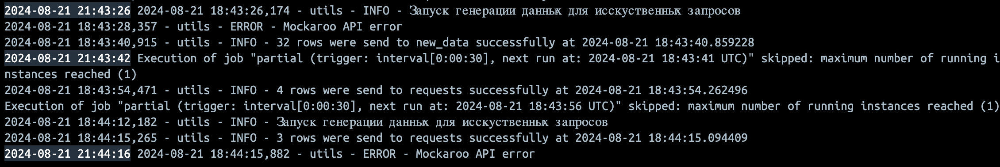
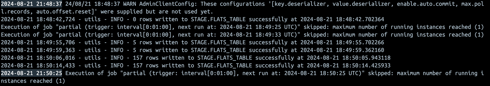
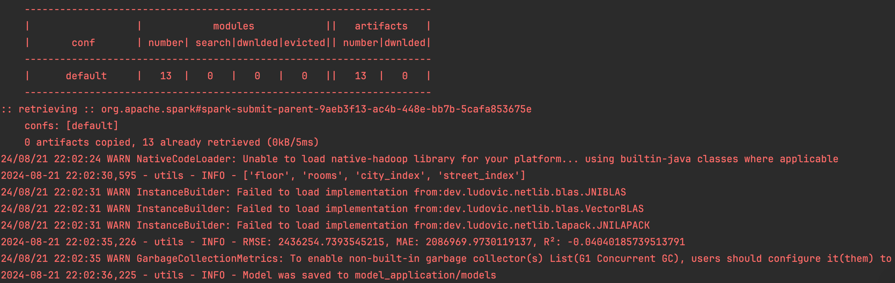
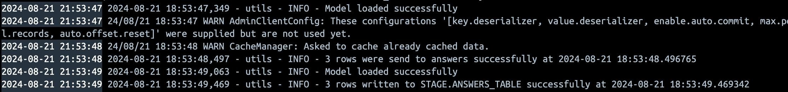
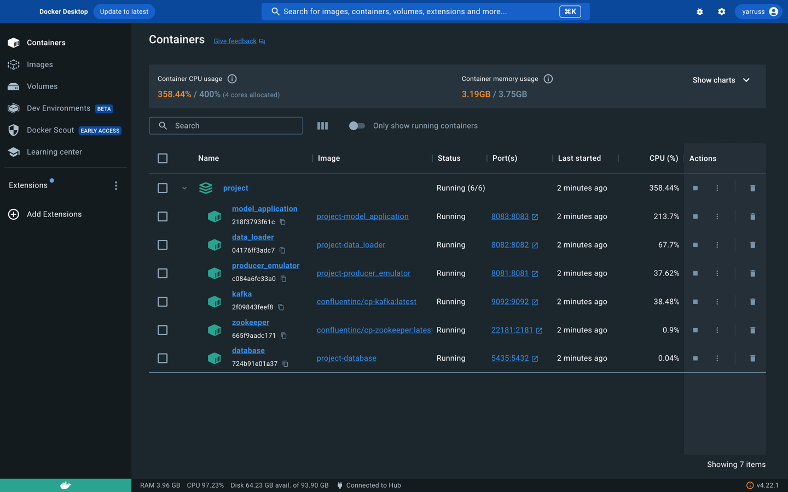
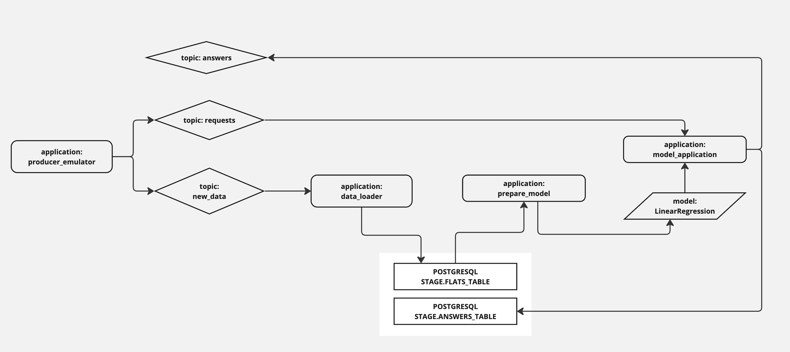

# Выпускной проект курса Spark-developer
## Otus_project: "Сервис моделирования рекомендованной цены жилой недвижимости"

### Цель проекта:
Подготовить спарк-приложения, формирующие данные, обучающие на данных модель и применяющие модель к новым данным о квартирах в городах РФ

### Что планировалось:
- Подготовить спарк-приложение для спора и генерирации данных из разных источников
- Сохранения данные спарком через jdbc конектор в базу данных в Postgresql
- При генерации данных и применении моделей должена планировалось использовать микробатчевую обработку данных и брокер сообщений
- Обучение данных планировалось выполнять батчами, через оркестратор или локально
- Применение моделей планировалось выполнять через SparkStreaming
- Результаты применнения моделей планировалось сохранять в Postgresql и отправлять в топик брокера сообщений

### Какие технологии использовались:
- в качестве языка интерфейса использовался Python, соответственно при работе со спарк - pyspark
- инфраструктурно использовался Docker для запуска приложений в контейнерах
- шедулер запуска приложений - библиотека Flask на Python
- для взаимодействия приложений использовался SparkStreaming и брокер Kafka
- для сохранения данных и результатов применения моделей PostgreSQL
- для генерации данных - API mockaroo, csv файлы и генератор python
- для обучения и применнения моделей - SparkML

### Что получилось:
Получилось сформировать 4 спарк приложения, каждое со своим функционалом:  

### Схема репозитория

        project
        |------README.md
        |------docker-compose
        |------Dockerfile
        |------init.sql
        |------requirements.txt
        |------utils.py
        |
        |------producer_emulator
        |      |-------producer_emulator.py
        |      |-------Dockerfile
        |      |-------data
        |              |-----city.csv
        |              |-----streets.csv
        |
        |------data_loader
        |      |-------data_loader.py
        |      |-------Dockerfile
        |
        |------model_prepare.py
        |
        |------model_application
               |-------model_application.py
               |-------Dockerfile
               |-------models

- Приложение producer_emulator это эмулятор стороннего сервиса, содержащего данные о квартирах, он выполняет 2 задачи:
Во-первых, он извлекает из csv названия городов России, обращается к mockaroo за названиями улиц, а при его недоступности берет наиболее популярные из csv.
Случайным образом создаются пары данных из городов и улиц, которые обогащаются через генерацию случайных значений (число комнат, этаж, цена)
Образовавшийся данные заливаются спарком в Kafka в топик "new_data" каждые 100 секунд
Во-вторых, создает имитацию запроса пользователей к сервису, как будто некие пользователи оправляют данные о своих квартирах, для определения цены
эти запрос заливаются спарком в Kafka в топик "requests" каждые 20 секунд, имитируя нагруженный сервис
Запускается приложение через Flask

- Приложение data_loader
Спарк приложение, которое выполняет функцию консьюмера и вычитывает данные из топика "new_data" и сохраняет каждый микробатч в PostgreSQL
Запускается приложение через Flask

- Приложение model_prepare
Спарк приложение, вычитывает данные из PostgreSQL и обучает на них модель инструментами SparkML, 
а также расчитывает метрики модели и сохраняет модель в папку директорию следующего модуля
Запускается вручную

- Приложение model_aplication
Спарк приложенеи, которое вычитывает пайплайн модели, получает данные из топика requests, применяет модель к данным и предсказывает цену недвижимости
Получившиеся результаты предсказаний отправляются в топик "answers" и сохраняются в базу данных PostgreSQL

PostgreSQL и Kafka как инфраструктура проекта запускаются в Docker контейнерах

Все общие функции (producer, consumer, чтение из DB, запись в DB, создание спарк сесии с конфигурацией и создание логгера) вынесены в единый модуль utils.py для выполнения требований DRY

producer_emulator, data_loader и model_aplication запускаются в Docker контейнерах, но могут запускаться локально без изменений кода

model_prepare, к сожалению, запускается руками
планировалось предусмотреть для него оркестрацию через Airflow однако запуск Airflow требует слишком много ресурсов
поэтому от этого решено было отказаться

    Запуск проекта классически выполняется командой docker-compose up -d в папке с файлом docker-compose.yaml

Схема архитектуры

### Планы и выводы по развитию:
- Написать webcrawler для сбор информации из реальных источников, там где это возможно
- Заменить Flask на Unicorn WSHI приложение
- Улучшить качество модели, повысить качество данных, обрабатывать выбросы
- Сформировть MLflow сервис
